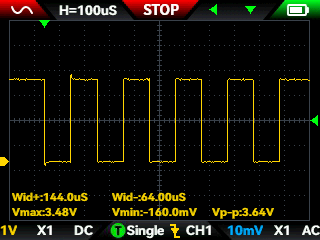

# project-05-icebreaker-fpga
First FPGA project on the iCEBreaker V1.1a (iCE40UP5K) -- fully open-source toolchain (Yosys/nextpnr-ice40/icestorm). Progressed from blinky through a debounced button, LED patterns, a traffic-light FSM, a precise UART transmitter verified on a real 9600-baud frame with an oscilloscope, and a final integration piece: FPGA button presses send a message over UART into Project 3's ESP32 datalogger, overriding its OLED and popping up on its live dashboard.

COMPLETE ✅

Goal: learn the open-source FPGA design flow (Verilog -> synthesis -> place&route -> bitstream -> program) from first principles, building up from a single blinking LED to a working UART transmitter verified on real hardware, then use it to make two separate projects (this one and Project 3) talk to each other over a physical wire.

I learned:
- Verilog describes hardware, not a sequence of steps -- every line in a module executes simultaneously, always. The real conceptual shift from software is thinking in terms of wires and clocked registers, not instructions.
- `<=` (non-blocking assignment) inside a clocked `always` block updates all registers simultaneously using their *old* values; this is what actually matches real hardware behavior.
- Debouncing a mechanical button in hardware is a saturating counter that only accepts a new state once it's been stable for a set number of clock cycles -- not a shift register (which gets prohibitively large for a real ~5ms bounce window).
- A Moore FSM -- one block deciding *what state comes next*, a separate combinational block deciding *what the outputs are* given the current state -- is the cleanest starting pattern for sequential design, and it's the same skeleton a UART transmitter uses.
- Auto-measurement parameters on an oscilloscope (e.g. pulse width) can silently aggregate across pulses of different widths in a capture window and mislead; a manual grid-division or cursor reading of one isolated pulse is more trustworthy.
- Floating, unconstrained FPGA I/O pins commonly idle near the supply rail due to internal weak pull-ups -- meaning voltage alone can't tell a real driven pin apart from an unused neighbor. Confirmed the physical PMOD pin location by briefly driving it to a clean 0V and finding it by elimination.
- The iCEBreaker's onboard FTDI chip (FT2232H) exposes a second, independent UART channel beyond the programming interface -- meaning a UART project doesn't need a PMOD or an external USB-serial adapter if you route to the right pin.

Progression (`firmware/`):
| # | Design | Concepts introduced |
|---|---|---|
| 1 | Blinky | Full toolchain flow, clock division |
| 2 | Button -> LED (combinational) | `wire`, `assign` |
| 3 | Debounced button | Saturating counter, bit-width sizing |
| 4 | LED binary counter | Bit-slicing across a wide counter |
| 5 | LED walker | `case`, concatenation `{}` |
| 6 | Traffic light | Moore FSM (sequential + combinational split) |
| 7 | Baud-rate tick test | Precise clock division, verified standalone before use |
| 8 | `uart_tx` (core module) | Parameterized module, shift-out via indexing |
| 9 | UART TX test (real speed) | Full 9600-baud frame, verified on oscilloscope |
| 10 | UART TX test (slow) | Same core module, 1s/bit, verified by eye |
| 11 | `fpga_messenger` | Multi-byte sequencing FSM, three-button protocol |

Full pinout and wiring for both the iCEBreaker and the iCEBreaker<->ESP32 link: [`hardware/wiring_notes.md`](hardware/wiring_notes.md)

Full debugging log (scope trigger issues, pin-finding technique, probe attenuation bug): [`notes/build_notes.md`](notes/build_notes.md)

## Integration with Project 3 (sensor datalogger)

The final design (`firmware/11_fpga_messenger.v`) sends a simple byte-level protocol over UART directly into Project 3's ESP32 (GPIO16, no level shifting -- both boards run 3.3V):

- **Button 1** -> `0x01` -- ESP32 hides its sensor readouts, OLED and dashboard show "waiting for message"
- **Button 2** -> sends a fixed message + `0x00` terminator -- message displays on both the OLED and a popup on the live dashboard
- **Button 3** -> `0x02` -- both revert to normal

Updated ESP32 sketch and dashboard: [`software/esp32_sketch.ino`](software/esp32_sketch.ino), [`software/dashboard.py`](software/dashboard.py). WiFi credentials and IP addresses have been replaced with placeholders (`YOUR_WIFI_SSID`, `YOUR_WIFI_PASSWORD`, `YOUR_LAPTOP_IP`) -- fill in your own before flashing.

Demo videos: [`media/videos/fpga_blinky.MOV`](media/videos/fpga_blinky.MOV) -- [`media/videos/steady_state_traffi_light.MOV`](media/videos/steady_state_traffi_light.MOV) -- [`media/videos/fpga_messenger_on_OLED.MOV`](media/videos/fpga_messenger_on_OLED.MOV) -- [`media/videos/fpga_messenger_on_dashboard.MOV`](media/videos/fpga_messenger_on_dashboard.MOV)

BOM:
| Part | Value / Part# | Qty | Notes |
|------|-----------------|-----|-------|
| FPGA dev board | iCEBreaker FPGA V1.1a | 1 | iCE40UP5K, SG48 package |
| PMOD headers | 2x6, 2.54mm | 2 | Soldered but unused in the final design |
| ESP32 dev board | ESP32 clone | 1 | Reused from Project 3, no new hardware purchased |

Instruments: FNIRSI 2C53T (oscilloscope), used to verify the real 9600-baud UART frame.

Toolchain: OSS CAD Suite (Yosys, nextpnr-ice40, icepack, iceprog) -- fully open source, no vendor tools required.
